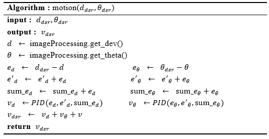
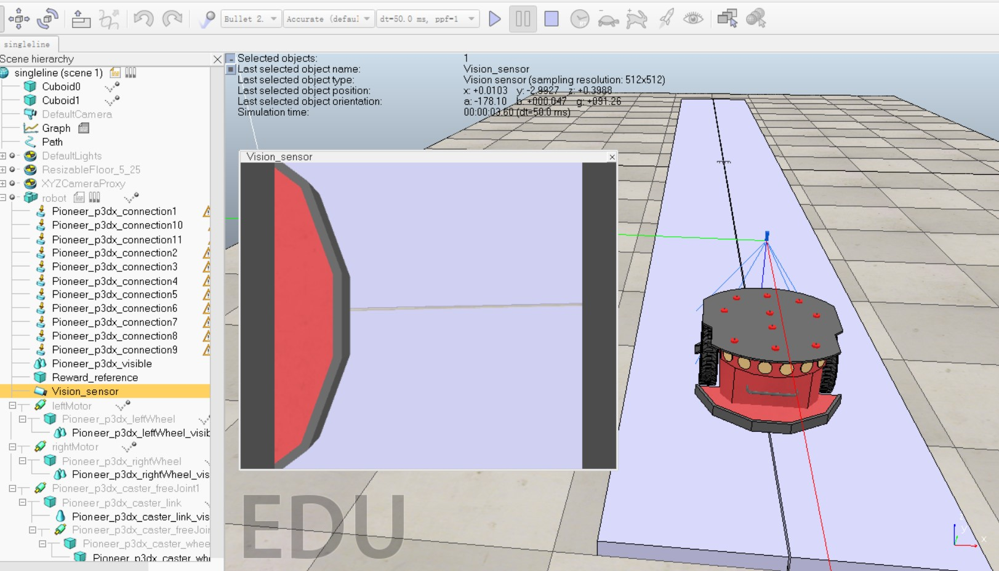

# Linear-path-tracking
## Using real-time RGB image for linear path tracking of mobile robots

The robot I used(**Pionner_p3dx**) adopts a differential drive method to control the motor through the underlying PID algorithm to achieve real-time adjustment of the body posture. In the process of designing the correcting controller, a rectification algorithm that combines the deviation distance information and the deflection angle information respectively calculated by the PID controller is proposed to improve the real-time performance of the system.

According to the above method, the movement process of the robot on the boiler wall is simulated in the V-REP. 

Simulation results show that this method can control the lateral position accuracy of climbing robots with high precision. Under the premise that the random disturbance amount is not more than ± 5%, the offset distance of the vehicle body can always be controlled within ±5mm in a continuous 50s stroke, and the expected design goal is achieved.

The results are as follows:

| Gaussian Interference | Lateral Error( *mm* ) |
| :-------------------: | :---------------: |
|         ± 2 %         |        ± 2        |
|         ± 5%          |        ± 3        |
|        ± 10 %         |        ± 6        |
|        ± 20 %         |       ± 10        |
